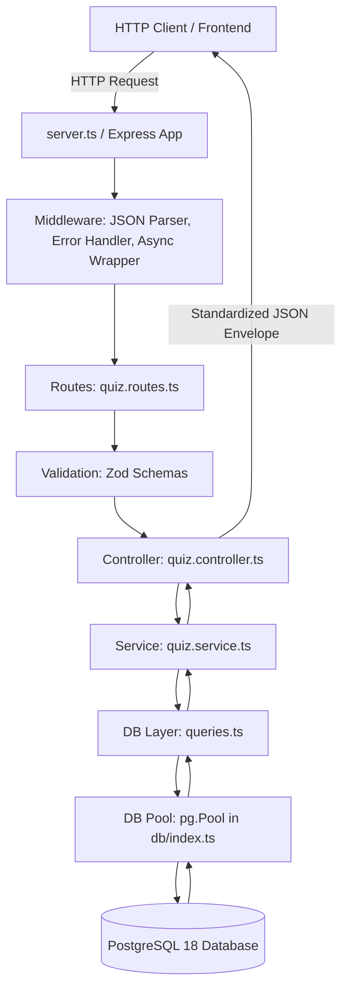

# System Architecture

## 1. Overview

ShikshaSetu is a full-stack education platform designed for government school students in Classes 8–10. The backend is implemented as a modular, layered REST API built on Node.js, Express, TypeScript, and PostgreSQL.

---

## 2. Architectural Layers

The backend strictly enforces separation of concerns across distinct layers:

### Layer Responsibilities & Strict Isolation Rules

| Layer | Directory | Responsibilities | Strict Isolation Rules |
|---|---|---|---|
| **Entry Point** | `src/server.ts` | Loads environment variables (`dotenv`), binds HTTP server to port, handles graceful shutdown. | Does not contain routing logic. |
| **Application Setup** | `src/app.ts` | Instantiates Express app, registers global middleware, mounts root route handlers. | Does not contain route business logic. |
| **Routing** | `src/routes/` | Maps HTTP verbs and URL paths to corresponding controller actions. | Contains zero business logic, zero DB queries, and zero `req`/`res` manipulation. |
| **Validation** | `src/schemas/` | Validates input data (URL params, query strings, request bodies) using Zod. | Runs before controllers execute business logic. |
| **Controller** | `src/controllers/` | Parses request data, invokes service functions, formats HTTP response envelopes (`{ success, data }`), and handles HTTP status codes. | **Controllers NEVER touch the database directly.** |
| **Service** | `src/services/` | Encapsulates all domain business logic, rules, calculations (e.g. server-side quiz scoring), and transaction workflows. | **Services NEVER touch `req` or `res` objects.** |
| **Database Queries** | `src/db/queries.ts` | Houses all parameterized SQL queries, mapping database rows to strongly typed domain models. | All SQL statements are parameterized ($1, $2) to eliminate SQL injection risks. |
| **Database Pool** | `src/db/index.ts` | Manages PostgreSQL connection lifecycle via `pg.Pool`, query logging, and transaction helpers. | Singleton connection pool shared across the entire application. |
| **Middleware** | `src/middleware/` | Global error handling, async exception catching (`asyncHandler`), authentication/authorization checks. | Catches uncaught exceptions to ensure consistent error response shapes without server crashes. |

---

## 3. Why Each Layer Exists

### Why Controllers Must Never Touch the Database
If controllers execute SQL directly:
1. Business logic becomes tightly coupled to Express HTTP transport. The logic cannot be reused in CLI scripts, background queues, or unit tests without mocking HTTP request/response objects.
2. Changes to database schema or SQL queries ripple directly into HTTP handling code.
3. Transaction boundaries and business validation become scattered across disparate endpoint handlers.

### Why Services Must Never Touch `req` / `res`
If services access Express `req` and `res`:
1. Services cannot be tested in isolation with simple JavaScript objects.
2. Business logic is permanently tied to HTTP, making it impossible to reuse in WebSockets, microservices, or job runners.
3. Modifying an HTTP header or status code could inadvertently alter domain calculation results.

### Why Schema Validation (Zod) Runs Before Service Execution
1. Protects internal services and database layers from malformed data, unexpected types, and prototype pollution.
2. Provides immediate, informative 400 Bad Request responses to clients without wasting database CPU cycles.
3. Automatically derives compile-time TypeScript types from runtime validation schemas.

### Why Centralized Error Handling is Mandatory
1. Eliminates repetitive `try / catch` boilerplate across every single controller method.
2. Guarantees a consistent JSON error format across all endpoints: `{ "success": false, "error": "..." }`.
3. Sanitizes internal stack traces and database error codes, preventing security vulnerabilities and data leakage in production.

---

## 4. Current State vs. Target State

### Current Repository State (Baseline)
- `src/server.ts`: Starts server on port 5000.
- `src/app.ts`: Express application with `GET /api/health`.
- Status: **HEALTH CHECK OPERATIONAL — QUIZ MODULE SCAFFOLDING PENDING.**

### Target State (This Milestone)
- Full hierarchical quiz browsing API:
  - `GET /api/classes`
  - `GET /api/classes/:classId/subjects`
  - `GET /api/subjects/:subjectId/chapters`
  - `GET /api/chapters/:chapterId/quizzes`
  - `GET /api/quizzes/:quizId/questions` (correct answers stripped)
- Quiz submission and server-side evaluation:
  - `POST /api/quizzes/:quizId/attempts`
- PostgreSQL integration with connection pool, migrations, and seed scripts.
