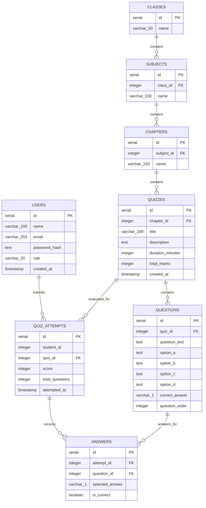

# Database Design & Implementation

## 1. Overview

- **Database Engine:** PostgreSQL 18.6 (Service: `postgresql-x64-18`, Binaries: `D:\postgres\bin\`)
- **Connection Client:** `pg` (node-postgres) with connection pooling (`pg.Pool`)
- **Target Schema Location:** `code/quiz-database/migrations/`
- **Seed Data Location:** `code/quiz-database/seeds/`

---

## 2. Entity Relationship Diagram (Target Schema)

---

## 3. Detailed Table Specifications

### `classes`
Stores educational class tiers (e.g. Class 8, Class 9, Class 10).
- `id`: `SERIAL PRIMARY KEY`
- `name`: `VARCHAR(50) NOT NULL UNIQUE` (e.g. 'Class 8', 'Class 9', 'Class 10')

### `subjects`
Stores curriculum subjects tied to a specific class.
- `id`: `SERIAL PRIMARY KEY`
- `class_id`: `INTEGER NOT NULL REFERENCES classes(id) ON DELETE CASCADE`
- `name`: `VARCHAR(100) NOT NULL` (e.g. 'Mathematics', 'Science')
- Indexes: `idx_subjects_class_id ON subjects(class_id)`

### `chapters`
Stores textbook chapters belonging to a subject.
- `id`: `SERIAL PRIMARY KEY`
- `subject_id`: `INTEGER NOT NULL REFERENCES subjects(id) ON DELETE CASCADE`
- `name`: `VARCHAR(150) NOT NULL` (e.g. 'Rational Numbers', 'Linear Equations')
- Indexes: `idx_chapters_subject_id ON chapters(subject_id)`

### `quizzes`
Stores quiz assessments created under a chapter.
- `id`: `SERIAL PRIMARY KEY`
- `chapter_id`: `INTEGER NOT NULL REFERENCES chapters(id) ON DELETE CASCADE`
- `title`: `VARCHAR(200) NOT NULL`
- `description`: `TEXT`
- `duration_minutes`: `INTEGER NOT NULL DEFAULT 15 CHECK (duration_minutes > 0)`
- `total_marks`: `INTEGER NOT NULL DEFAULT 5 CHECK (total_marks > 0)`
- `created_at`: `TIMESTAMP NOT NULL DEFAULT CURRENT_TIMESTAMP`
- Indexes: `idx_quizzes_chapter_id ON quizzes(chapter_id)`

### `questions`
Stores four-choice multiple-choice questions belonging to a quiz.
- `id`: `SERIAL PRIMARY KEY`
- `quiz_id`: `INTEGER NOT NULL REFERENCES quizzes(id) ON DELETE CASCADE`
- `question_text`: `TEXT NOT NULL`
- `option_a`: `TEXT NOT NULL`
- `option_b`: `TEXT NOT NULL`
- `option_c`: `TEXT NOT NULL`
- `option_d`: `TEXT NOT NULL`
- `correct_answer`: `VARCHAR(1) NOT NULL CHECK (correct_answer IN ('A', 'B', 'C', 'D'))`
- `question_order`: `INTEGER NOT NULL DEFAULT 1`
- Indexes: `idx_questions_quiz_id ON questions(quiz_id)`

### `quiz_attempts`
Records an evaluation session when a student submits a quiz.
- `id`: `SERIAL PRIMARY KEY`
- `student_id`: `INTEGER` (Nullable / plain integer for current milestone; will link to `users.id` upon auth integration)
- `quiz_id`: `INTEGER NOT NULL REFERENCES quizzes(id) ON DELETE CASCADE`
- `score`: `INTEGER NOT NULL CHECK (score >= 0)`
- `total_questions`: `INTEGER NOT NULL CHECK (total_questions > 0)`
- `attempted_at`: `TIMESTAMP NOT NULL DEFAULT CURRENT_TIMESTAMP`
- Indexes: `idx_attempts_quiz_id ON quiz_attempts(quiz_id)`

### `answers`
Records the individual option selected for each question in an attempt.
- `id`: `SERIAL PRIMARY KEY`
- `attempt_id`: `INTEGER NOT NULL REFERENCES quiz_attempts(id) ON DELETE CASCADE`
- `question_id`: `INTEGER NOT NULL REFERENCES questions(id) ON DELETE CASCADE`
- `selected_answer`: `VARCHAR(1) NOT NULL CHECK (selected_answer IN ('A', 'B', 'C', 'D'))`
- `is_correct`: `BOOLEAN NOT NULL`
- Unique Constraint: `UNIQUE (attempt_id, question_id)` — ensures a student cannot submit duplicate answers for the same question within a single attempt.
- Indexes: `idx_answers_attempt_id ON answers(attempt_id)`, `idx_answers_question_id ON answers(question_id)`

### `users`
Retained for forward compatibility with user authentication and student profiles.
- `id`: `SERIAL PRIMARY KEY`
- `name`: `VARCHAR(100) NOT NULL`
- `email`: `VARCHAR(255) UNIQUE NOT NULL`
- `password_hash`: `TEXT NOT NULL`
- `role`: `VARCHAR(20) NOT NULL CHECK (role IN ('student', 'teacher'))`
- `created_at`: `TIMESTAMP NOT NULL DEFAULT CURRENT_TIMESTAMP`

---

## 4. Schema Comparison & Evolution

During our initial repository audit, two schemas were reviewed:

1. **Root `schema.sql` (Flat MVP Schema by Database Teammate):**
   - Had `users`, `quizzes` (with a plain text `subject` column), `questions`, `options` (separate table with 4 rows per question), `quiz_attempts`, `student_answers`.
   - Lacked `classes` and `chapters` tables.
   - Deferral note in `README (1).md`: "subject is a plain text column on quizzes, not a separate subjects/chapters hierarchy — that's intentionally deferred until the class/chapter browsing flow is actually being built."

2. **Prompt Schema in `code/quiz-database/` (Hierarchical Education Schema):**
   - Implements full hierarchy: `classes` -> `subjects` -> `chapters` -> `quizzes` -> `questions`.
   - Inlines the 4 options into `questions` (`option_a`, `option_b`, `option_c`, `option_d`, `correct_answer`), which aligns with standard school MCQ paper formats and simplifies atomic question retrieval.
   - Powers the required endpoints: `/api/classes`, `/api/classes/:classId/subjects`, `/api/subjects/:subjectId/chapters`, `/api/chapters/:chapterId/quizzes`, `/api/quizzes/:quizId/questions`.

---

## 5. Migration Strategy

We adopt plain, numbered SQL migration files stored in `code/quiz-database/migrations/`:
- `001_initial_schema.sql`
- Executed via:
  1. Automated Node script: `npm run db:migrate` (using `pg` pool).
  2. Manual PostgreSQL CLI: `& "D:\postgres\bin\psql.exe" -U postgres -d <dbname> -f migrations/001_initial_schema.sql`.

**Why Numbered SQL Files?**
- Zero vendor lock-in.
- Transparent and reviewable in Git diffs.
- Executable in CI/CD pipelines, local development, and production environments alike.

---

## 6. Verified Database State & Row Counts (as of 2026-09-05)

The database `shikshasetu_quiz` has been successfully initialized, migrated, and seeded:

| Table | Migration File | Seed File | Verified Row Count | Status |
|---|---|---|---|---|
| `classes` | `001_initial_schema.sql` | `001_seed_quiz_data.sql` | 3 rows | **VERIFIED** |
| `subjects` | `001_initial_schema.sql` | `001_seed_quiz_data.sql` | 6 rows | **VERIFIED** |
| `chapters` | `001_initial_schema.sql` | `001_seed_quiz_data.sql` | 7 rows | **VERIFIED** |
| `quizzes` | `001_initial_schema.sql` | `001_seed_quiz_data.sql` | 4 rows | **VERIFIED** |
| `questions` | `001_initial_schema.sql` | `001_seed_quiz_data.sql` | 9 rows | **VERIFIED** |
| `quiz_attempts` | `001_initial_schema.sql` | Dynamic via API | 1 row | **VERIFIED** |
| `answers` | `001_initial_schema.sql` | Dynamic via API | 3 rows | **VERIFIED** |
| `users` | `001_initial_schema.sql` | `001_seed_quiz_data.sql` | 3 rows | **VERIFIED** |

